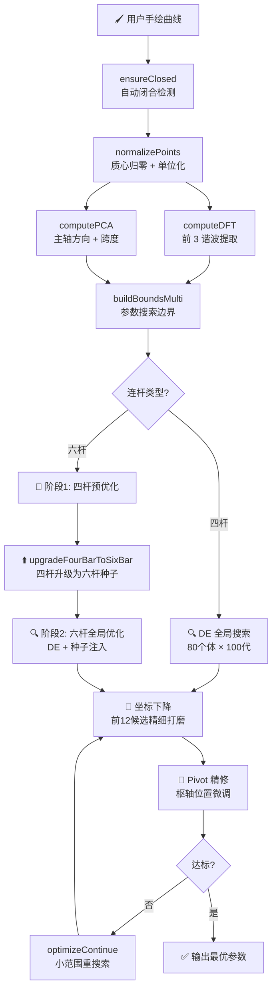

# 🎨 Track Generation — 多连杆机构轨迹综合

> **随手一画，连杆机构生成。** 在画布上自由绘制任意封闭曲线，算法自动合成能精确复现该轨迹的平面连杆机构。

<div align="center">


</div>

---

## ✨ 特性一览

- 🖌️ **自由手绘输入** — 鼠标/触控笔画任意封闭曲线，无需精确参数
- ⚙️ **三类机构支持** — 四杆机构、六杆瓦特I型、六杆斯蒂芬森I型
- 🧠 **智能优化引擎** — 差分进化 + 坐标下降 + Pivot 精修三级递进
- 📐 **DFT 引导对齐** — 傅里叶分析自动匹配曲线相位，消除旋转歧义
- 🎯 **自动迭代收敛** — 设定目标误差后全自动优化，无需手动反复操作
- 📊 **实时可视化** — Canvas 渲染机构运动、耦合曲线与目标轨迹对比
- 🔧 **纯前端计算** — 所有运动学求解与优化均在浏览器端完成，无需后端

---

## 🚀 快速开始

```bash
# 1. 安装依赖
npm install

# 2. 启动开发服务器 (端口 1145)
npm run dev

# 3. 打开浏览器访问 http://localhost:1145
```

> ⚠️ Windows 用户若遇到 PowerShell 执行策略错误，请参考 [运行说明](#️-运行说明)。

---

## 🧭 目录

- [🎨 效果演示](#-效果演示)
- [❓ 问题定义](#-问题定义)
- [🔗 连杆类型](#-连杆类型)
- [📁 项目结构](#-项目结构)
- [🔄 计算管线](#-计算管线)
- [🧩 模块详解](#-模块详解)
  - [1. 四连杆运动学](#1-四连杆运动学-fourbarjs)
  - [2. 多连杆运动学](#2-多连杆运动学-multibarjs)
  - [3. 几何工具](#3-几何工具-geometryjs)
  - [4. 傅里叶分析](#4-傅里叶分析-fourierjs)
  - [5. 优化器](#5-优化器-optimizerjs)
- [📏 误差度量](#-误差度量)
- [⚡ 优化流程](#-优化流程)
- [🛠️ 运行说明](#️-运行说明)
- [📚 技术栈](#-技术栈)
- [🤝 贡献指南](#-贡献指南)
- [📄 许可证](#-许可证)

---

## 🎨 效果演示

> 📸 *（此处可放置应用截图与动图演示）*

| 输入 | 输出 |
|:---:|:---:|
| 手绘目标曲线 | 最优机构 + 耦合曲线 |
| 椭圆、水滴、8字… | 四杆 / 六杆瓦特I / 斯蒂芬森I |

---

## ❓ 问题定义

### 📥 输入

用户在画布上**徒手绘制**的任意封闭曲线（支持鼠标与触控）。

### 📤 输出

一组多连杆机构的几何参数，使机构**输出点 P** 的运动轨迹最大程度逼近用户绘制的目标曲线。

---

### 🔩 四杆机构 · 9 参数

最经典的平面连杆机构，由一个曲柄驱动、一个摇杆输出，结构简洁可靠。

```
O₂(x, y)  — 曲柄旋转中心（地面枢轴 1）
O₄(x, y)  — 摇杆旋转中心（地面枢轴 2）
a         — 曲柄长度  (O₂ → A)
b         — 连杆长度  (A  → B)
c         — 摇杆长度  (B  → O₄)
e         — 耦合点距离 (A  → P)
β         — 耦合角
```

```
          P ← 耦合点（画出轨迹）
         ⁄
        ⁄ e
       A ——————— B
       |   b    |
      a|         |c
       |         |
      O₂————————O₄
           g        ← 地面连杆（固定）
```

---

### 🔩 六杆瓦特I型 · 17 参数

两个四杆子回路通过耦合连杆 **B–D** 串联，可实现更复杂的运动规律。

```
回路 1 : O₂–A–B–O₄    (曲柄 a₁, 连杆 b₁, 摇杆 c₁)
回路 2 : O₄–D–E–O₆    (曲柄 a₂, 连杆 b₂, 摇杆 c₂)
耦  合 : B —— D         (刚性连杆 lBD, 耦合角 φBD)
输  出 : P 在 DE 上     (距离 e₂, 角度 β₂)
```

```
          P ← 输出点
         ⁄
        ⁄ e₂
       D ——————— E
       |   b₂    |
      a₂|         |c₂
       |         |
O₂——A———B       O₆
 |  b₁  |        |
a₁|     |c₁      |
 |      |        |
 O₂————O₄——————O₆
    g₁       g₂
```

---

### ⚠️ 物理约束

| 约束 | 数学条件 | 工程意义 |
|:-----|:---------|:---------|
| **可装配性** | 最长杆 < 其余三杆之和 | 四杆子回路能形成闭合链 |
| **Grashof 曲柄-摇杆** | a 最短 且 a + 最长 ≤ 其余两杆之和 | 曲柄可整周旋转，轨迹连续闭合 |

> 💡 非 Grashof 机构也能生成轨迹，但曲柄无法转满 360°，输出曲线会出现断点。优化器对非 Grashof 机构施加**软惩罚**而非直接淘汰，保留可行域边界的梯度信息。

---

## 🔗 连杆类型

| 类型 | ID | 参数数 | 典型能力 |
|:-----|:--:|:------:|:---------|
| **四杆机构** | `fourbar` | 9 | 椭圆、水滴形、简单环 |
| **六杆瓦特I型** | `watt1` | 17 | 8字形、非对称环、复杂闭合曲线 |
| **六杆斯蒂芬森I型** | `stephenson1` | 17 | 含三元连杆，运动规律更丰富 |

> 🎯 **选择建议**：先以四杆快速收敛（秒级），若不满意再切换六杆精细拟合（十秒级）。四杆结果会自动作为六杆优化的初始种子，加速收敛。

---

## 📁 项目结构

```
track-generation/
├── index.html                    # 入口 HTML
├── vite.config.js                # Vite 配置 (dev :1145 / preview :5140)
├── package.json                  # 依赖: Vue 3 + Vite
│
└── src/
    ├── main.js                   # Vue 应用入口
    ├── App.vue                   # 根组件
    ├── assets/
    │   └── main.css              # 全局样式
    │
    ├── engine/                   # 🧠 计算引擎（纯 JS，零框架依赖）
    │   ├── geometry.js           #   几何工具：坐标变换 · 重采样 · PCA · 距离度量
    │   ├── fourbar.js            #   四杆运动学：位置求解 · 耦合曲线 · Grashof 判定
    │   ├── multibar.js           #   多杆运动学：六杆瓦特I / 斯蒂芬森I 求解
    │   ├── fourier.js            #   离散傅里叶变换：DFT + 相位引导对齐
    │   └── optimizer.js          #   核心优化器：DE + 坐标下降 + Pivot 精修
    │
    ├── composables/              # 🔄 Vue 响应式状态层
    │   ├── useTrajectory.js      #   手绘轨迹状态（支持 O₂ / O₄ / O₆ 三枢轴）
    │   ├── useLinkage.js         #   优化编排 · 多连杆类型管理 · 预归一化
    │   └── useCanvas.js          #   Canvas 渲染（坐标系 · 缩放 · 平移）
    │
    └── components/               # 🖼️ Vue UI 组件
        ├── layout/
        │   └── AppLayout.vue     #   主布局
        ├── canvas/
        │   └── UnifiedCanvas.vue #   绘图画布 + 多杆机构可视化
        ├── panels/
        │   ├── ControlPanel.vue  #   控制面板容器
        │   └── LinkagePanel.vue  #   类型选择 · 优化按钮 · 参数表 · 误差显示
        └── ui/
            └── SliderControl.vue #   通用滑块组件
```

| 层级 | 职责 |
|:-----|:-----|
| `engine/` | 纯计算逻辑，可独立于 Vue 运行与测试 |
| `composables/` | Vue 响应式状态桥接，连接 engine 与 UI |
| `components/` | 用户界面，负责交互与渲染 |

---

## 🔄 计算管线



### 管线要点

| 阶段 | 做什么 | 为什么 |
|:-----|:-------|:-------|
| **预归一化** | 曲线平移至原点、缩放至单位圆 | 统一不同大小曲线的参数尺度 |
| **DFT 分析** | 提取前 3 谐波的幅度与相位 | k=1 谐波主导椭圆分量，用于边界估计与相位对齐 |
| **PCA 分析** | 计算曲线主轴方向与跨度 | 为地面枢轴 O₂/O₄/O₆ 设定合理搜索范围 |
| **递进优化** | DE → 坐标下降 → Pivot 精修 | 全局探索 → 局部开发 → 微调收敛 |
| **自动迭代** | 未达标则缩小范围重新搜索 | 无需手动反复操作 |

---

## 🧩 模块详解

### 1. 四连杆运动学 (`fourbar.js`)

给定曲柄转角 θ₂，逐步求解整个机构的位置与姿态。

```
输入: θ₂ (曲柄转角, 0 → 2π)

步骤:
  ① A = O₂ + a·(cos θ₂, sin θ₂)                  ← 曲柄端点
  ② d = |O₄ − A|                                   ← A 到 O₄ 距离
  ③ cos φ = (b² + d² − c²) / (2bd)                 ← 余弦定理 (△ABO₄)
  ④ φ = atan2(O₄ − A)                              ← O₄A 基线方向
  ⑤ γ = acos(cos φ)                                ← 连杆 b 与基线 d 夹角
  ⑥ θ₃ = φ − γ                                     ← 连杆 AB 绝对角度
  ⑦ B = A + b·(cos θ₃, sin θ₃)                    ← 连杆-摇杆铰接点
  ⑧ P = A + e·(cos(θ₃+β), sin(θ₃+β))             ← 🎯 耦合点（输出轨迹）
```

对 360 个等间距 θ₂ 逐一求解，得到完整的闭合耦合曲线。

| 导出函数 | 用途 |
|:---------|:-----|
| `solveFourBar(a,b,c,θ,O₂,O₄)` | 单角度位置求解，无解返回 null |
| `couplerPoint(A,θ₃,e,β)` | 由连杆状态计算耦合点 P |
| `computeCouplerCurve(params, 360)` | 360 角度全扫描 → 完整耦合曲线 |
| `getLinkageState(params, θ)` | 获取单角度完整机构状态（供渲染） |
| `isAssemblable(a,b,c,gd)` | 三角形不等式——四杆能否装配 |
| `isGrashofCrankRocker(a,b,c,gd)` | Grashof 曲柄-摇杆判定 |

---

### 2. 多连杆运动学 (`multibar.js`)

支持三种机构类型的正向运动学求解，统一接口 `solveLinkage(type, params, theta2)`。

#### 🔹 六杆瓦特I型 — `solveWattI`

```
① 求解子回路1: O₂–A–B–O₄  →  得到 A, B
② 耦合三角形 O₄–B–D (SSS 求解):
    已知 |O₄B| = c₁, |O₄D| = a₂, |BD| = lBd
    余弦定理 + 装配模式选择  →  D
③ 求解子回路2: O₄–D–E–O₆  →  得到 E
④ 输出点 P: 在 DE 上，距离 e₂，角度 β₂
```

#### 🔹 六杆斯蒂芬森I型 — `solveStephensonI`

```
① 求解子回路1: O₂–A–B–O₄  →  得到 A, B
② 三元连杆 ABD  →  D 在 AB 延长线上
③ 子回路2: 以实际 |O₄D| 替代 a₂，求解 O₄–D–E–O₆
④ 输出点 P: DE 中点
```

---

### 3. 几何工具 (`geometry.js`)

纯函数几何工具库，为运动学求解与优化提供基础运算。

| 函数 | 用途 | 领域 |
|:-----|:-----|:-----|
| `cartesianToPolar` / `polarToCartesian` | 直角 ↔ 极坐标变换 | 坐标变换 |
| `centroid` | 点集质心（算术平均） | 计算几何 |
| `dist` / `distSq` | 两点欧氏距离 | 距离度量 |
| `boundingBox` | 轴对齐包围盒 (AABB) | 几何边界 |
| `cumulativeDistances` | 折线累积弦长 | 弧长参数化 |
| `resampleCurve` | 等弧长线性插值重采样 | 曲线参数化 |
| `normalizeCurve` | 平移至质心 + 缩放至单位最大半径 | 形状归一化 |
| `chamferDistance` | 双点集双向最近邻对称距离 | 形状匹配 |
| `closestPointOnSegment` | 点到线段最近点（正交投影, t∈[0,1]） | 投影几何 |
| `computePCA` | 协方差矩阵 → 主轴/次轴方向及跨度 | 主成分分析 |
| `transformPoints` | 平移 + 均匀缩放 | 仿射变换 |
| `fitToBounds` | 等比缩放至指定矩形区域内 | 几何适配 |

---

### 4. 傅里叶分析 (`fourier.js`)

将 2D 封闭曲线视为复信号 $z[n] = x[n] + i \cdot y[n]$，进行离散傅里叶变换：

$$Z[k] = \frac{1}{N} \sum_{n=0}^{N-1} z[n] \cdot e^{-i \cdot 2\pi k \cdot n / N}$$

每个谐波 $k$ 返回：`{ freq, re, im, amp, phase }`

#### 应用① — f₁ 幅度边界估计

$k=1$ 谐波（基频）的幅度反映了曲线的主导尺度，用于设定曲柄长度 $a$ 的搜索范围上下界。

#### 应用② — DFT 引导循环对齐

两条闭合曲线比较时，$k=1$ 谐波的相位差给出最佳偏移的近似位置：

```
预计算: 目标曲线 k=1 相位 φ_target
每次评估: 候选曲线 k=1 相位 φ_candidate

Δφ = φ_target − φ_candidate
est_shift = round(Δφ / 2π × N)

在 [est−5, est+5] 邻域内逐偏移搜索 RMS 最小值
```

> 💡 $k=1$ 谐波捕捉了曲线的主导椭圆分量，其相位差对应了两条曲线的大致旋转偏移量。在估计值邻域搜索确保精度，同时将搜索范围从全量程缩小到局部窗口。

---

### 5. 优化器 (`optimizer.js`)

核心优化引擎，采用**三级递进**策略：全局探索 → 局部开发 → 枢轴微调。

#### 5.1 搜索边界 (`buildBoundsMulti`)

根据连杆类型为每个参数设定 `[min, max]` 范围：

| 参数 | 边界设定方式 |
|:-----|:------------|
| O₂, O₄ | PCA 主轴跨度，不超过 maxR |
| O₆ (六杆) | PCA 主轴跨度 ×1.2，沿 O₄ 延伸方向 |
| a / a₁ | f₁Amp 辅助估算，自交曲线范围更宽 |
| b, b₁, b₂, c, c₁, c₂, e, e₂ | maxR × [0.2, 3.0] |
| β, β₂, φBd, φDe | [−π, π] 全范围 |

同时缓存目标曲线的 $k=1$ 相位供 DFT 引导对齐使用。

#### 5.2 差分进化 (`differentialEvolutionMulti`)

```
算法: DE/rand/1
种群: NP = 80
代数: 100 ~ 140（自交曲线 +40）
种子注入: 四杆升级结果替换最差个体

每代对每个个体:
  随机选取 3 个互异个体 a, b, c
  变异: trial = a + F × (b − c)      F ∈ [0.5, 0.9]
  交叉: 以 85% 概率采用 trial 各维度
  选择: 若 trial 误差 < 当前个体误差 → 替换
```

#### 5.3 坐标下降 (`coordinateDescentMulti`)

对 DE 输出的前 12 名候选逐一精细打磨。

```
每轮:
  随机打乱参数顺序（避免固定方向偏置）
  对每个参数:
    沿 ±delta 试探  (delta₀ = 当前值 × 6%)
    若改进 → 接受，delta × 1.4
  若全轮无改进 → 所有 delta × 0.4
  所有 delta < 1e−9 → 停止

收敛后 ±15% 扰动重启 ×2
```

#### 5.4 Pivot 精修 (`refinePivotsMulti`)

固定连杆尺寸参数，仅对地面枢轴位置做更精细的坐标下降。

```
四杆: [o2x, o2y, o4x, o4y]     4 变量
六杆: [o2x, o2y, o4x, o4y, o6x, o6y]  6 变量
步长: 当前值 × 2%（主 CD 为 6%）
迭代: 200 轮
```

#### 5.5 递进式优化策略

六杆机构采用**两阶段**优化，四杆结果作为六杆的"热身"：

```
阶段 1 — 四杆预优化
  DE (80×100) → CD (400轮) → Pivot (200轮)
  → upgradeFourBarToSixBar()
      a₁=a, b₁=b, c₁=c              ← 回路1 继承四杆
      a₂=0.8a, b₂=0.7b, c₂=0.7c    ← 回路2 缩小
      O₆ 置于 O₄ 延长方向
      lBd, φBd 等耦合参数按启发式设定

阶段 2 — 六杆全局优化
  DE (80×140) + 四杆种子注入 → CD (500轮) → Pivot (200轮)
  阶段1 升级结果替换 DE 种群最差个体，加速收敛
```

---

## 📏 误差度量

`evaluateError(params, targetCurve)` 是优化的核心评估函数，每次候选参数都会调用。

$$\text{error} = 0.6 \times \text{RMS}_{\text{aligned}} + 0.4 \times \text{Chamfer} + \text{GrashofPenalty}$$

### ① 循环对齐 RMS（权重 60%）

两条闭合曲线需先对齐起始点再逐点比较：

```
目标 k=1 相位（预计算）→ 候选 k=1 相位 → 估算最佳偏移

在 [est−5, est+5] 范围内逐偏移搜索:
  rms[shift] = √( Σᵢ ‖Pᵢ_target − Pᵢ₊shift_candidate‖² / N )

取 min(rms)
```

> ⚠️ 保留点的顺序——对 8 字形等自交曲线，顺序决定了曲线的拓扑结构，不能打乱。

### ② Chamfer 距离（权重 40%）

$$\text{Chamfer}(A,B) = \underset{a \in A}{\text{avg}}\ \min_{b \in B}\|a-b\| + \underset{b \in B}{\text{avg}}\ \min_{a \in A}\|a-b\|$$

双向最近邻平均距离。补充 RMS 在形状覆盖度上的盲区——如果候选曲线只覆盖了目标曲线的部分区域，Chamfer 能从另一方向检测到。

### ③ Grashof 软惩罚

对非 Grashof 机构施加基于违反程度的**连续惩罚**，使误差地貌在可行域边界处平滑过渡：

```
violation = max(0, (最短杆 + 最长杆) − 其余两杆之和)
crankPenalty = (a 不是最短杆) ? 0.25 : 0
penalty = crankPenalty + 0.25 × (1 − exp(−violation / (gd × 0.05)))

范围: [0, 0.5]
```

采用 **sigmoid 函数**而非阶梯函数——惩罚随违反程度连续增长，保留了朝向可行域的梯度信息，引导优化器"滑向"合法区域。

---

## ⚡ 优化流程

### 预归一化

优化前将目标曲线一次性归一化到**单位圆空间**（质心原点，maxR = 1）。所有参数在 $[0, 1]$ 范围内搜索，统一了不同大小曲线的参数尺度。优化完成后将结果反归一化回原始坐标用于显示。

### 自动闭合

检测首尾点距离：若超过包围盒对角线的 **1.5%**，自动将首点追加到末尾形成闭合环。

### 递进式优化策略

```
┌─ 四杆机构 ─────────────────────────────────────┐
│ 第1轮:  DE(NP=80, 100~140代)                    │
│         → CD(400~500轮) → Pivot(200轮)          │
│ 后续:   缩小范围 DE(NP=40, 60代)                 │
│         → CD(300轮) → Pivot(200轮)              │
└─────────────────────────────────────────────────┘

┌─ 六杆机构 ─────────────────────────────────────┐
│ 阶段1:  四杆预优化 (同上)                        │
│         → upgradeFourBarToSixBar() 升级为种子     │
│ 阶段2:  六杆 DE(NP=80, 140代) + 种子注入         │
│         → CD(500轮) → Pivot(200轮)              │
│ 后续:   缩小范围 DE → CD → Pivot                 │
└─────────────────────────────────────────────────┘
```

### 目标误差与自动迭代

设定目标误差阈值后，优化器会**自动迭代**直到达标或收敛停滞，无需手动反复点击。

---

## 🛠️ 运行说明

### ✅ 方式一：VS Code 任务（推荐）

| 操作 | 快捷键 / 方式 |
|:-----|:-------------|
| 生产构建 | `Ctrl+Shift+B` |
| 开发服务器 | `Ctrl+Shift+P` → 运行任务 → **dev (开发服务器)** |
| 预览构建 | `Ctrl+Shift+P` → 运行任务 → **preview (预览)** |

### ✅ 方式二：直接使用 Node

```bash
# 开发模式（端口 1145）
node ./node_modules/vite/bin/vite.js

# 生产构建
node ./node_modules/vite/bin/vite.js build

# 预览构建产物（端口 5140）
node ./node_modules/vite/bin/vite.js preview
```

### ⚠️ 方式三：npm（需修复 PowerShell 执行策略）

```bash
# 若遇到 "无法加载文件 ...\npm.ps1" 错误：
# 以管理员身份运行 PowerShell，执行：
Set-ExecutionPolicy -Scope CurrentUser -ExecutionPolicy RemoteSigned

# 或切换到 CMD 终端再运行：
npm install
npm run dev
npm run build
npm run preview
```

---

## 📚 技术栈

| 层级 | 技术 | 用途 |
|:-----|:-----|:-----|
| 🖼️ 前端框架 | Vue 3.4 (Composition API) | 响应式 UI 与状态管理 |
| ⚡ 构建工具 | Vite 5.x | 开发服务器 + 生产构建 |
| 🧠 计算引擎 | 纯 JavaScript (ES Module) | 运动学求解 · 傅里叶分析 · 优化算法 |
| 🎨 渲染 | HTML5 Canvas 2D | 轨迹绘制 · 机构可视化 |
| 📐 优化算法 | Differential Evolution + Coordinate Descent | 全局搜索 + 局部精修 |

---

## 🤝 贡献指南

欢迎提交 Issue 与 Pull Request！

- 🐛 **Bug 报告**：请附上复现步骤与目标曲线截图
- 💡 **功能建议**：欢迎在 Issue 中讨论新机构类型或优化策略
- 🔧 **代码贡献**：请确保 `engine/` 模块保持纯函数风格，不引入 Vue 依赖

---

## 📄 许可证

[MIT License](LICENSE) — 自由使用、修改与分发。
